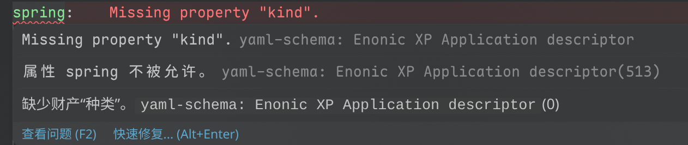
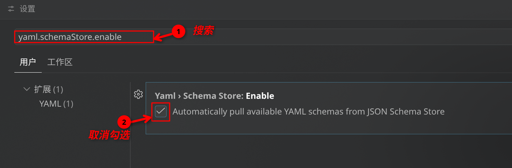

最近尝试在vscode中开发SpringBoot项目,遇到一个很搞心态的问题,yaml报错,问题如下:

这其实是因为 Red Hat 的 YAML 插件为了图方便，默认集成了一个叫 **SchemaStore** 的线上数据库。这个数据库会自动根据你的文件名（比如 `application.yaml`）去盲猜它属于哪个框架。结果 SchemaStore 的规则不知道哪天抽风，把 `application.yaml` 错误地优先匹配给了 Enonic XP，导致所有写 Spring Boot 的人都无辜躺枪。

既然它自动匹配不靠谱，我们直接**把它的“自动线上的 Schema 匹配”功能关掉**，或者**手动覆盖它**。

让 YAML 插件只做语法检查，别去网上瞎匹配那些奇怪的框架规则。

1. 打开 VS Code 设置（快捷键 `Ctrl + ,`）。
2. 在顶部的搜索框输入：**`yaml.schemaStore.enable`**
3. 找到  **Yaml: Schema Store › Enable** 这一项，** 把它的勾选去掉（设置为 False）**。

> 关掉这个之后，它就不会再去网上扯一些 Enonic XP 之类莫名其妙的规则来恶心你了。而你本地安装的 `Spring Boot Properties Yaml` 插件依然可以正常为你提供 `spring` 和 `mybatis` 的完美补全，两全其美！
